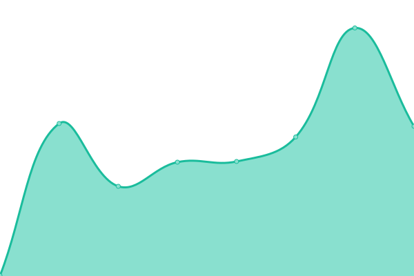

# [📈 Live Status](https://Genesis-Research.github.io/Genesis-Research/upptime): <!--live status--> **🟩 All systems operational**

This repository contains the open-source uptime monitor and status page for [Genesis Research](https://www.genesisrg.com/), powered by [Upptime](https://github.com/upptime/upptime).

With [Upptime](https://upptime.js.org), you can get your own unlimited and free uptime monitor and status page, powered entirely by a GitHub repository. We use [Issues](https://github.com/Genesis-Research/Genesis-Research/upptime/issues) as incident reports, [Actions](https://github.com/Genesis-Research/Genesis-Research/upptime/actions) as uptime monitors, and [Pages](https://Genesis-Research.github.io/Genesis-Research/upptime) for the status page.

<!--start: status pages-->
<!-- This summary is generated by Upptime (https://github.com/upptime/upptime) -->
<!-- Do not edit this manually, your changes will be overwritten -->
<!-- prettier-ignore -->
| URL | Status | History | Response Time | Uptime |
| --- | ------ | ------- | ------------- | ------ |
|  [Genesis Public Website](https://www.genesisrg.com/) | 🟩 Up | [genesis-public-website.yml](https://github.com/Genesis-Research/upptime/commits/HEAD/history/genesis-public-website.yml) | 

 841ms
     
 | 

<a href="https://Genesis-Research.github.io/upptime/history/genesis-public-website">100.00%</a>
    

|  [Traefik Proxy](https://traefik.genesisresearch.io/) | 🟩 Up | [traefik-proxy.yml](https://github.com/Genesis-Research/upptime/commits/HEAD/history/traefik-proxy.yml) | 

 212ms
     
 | 

<a href="https://Genesis-Research.github.io/upptime/history/traefik-proxy">100.00%</a>
    

|  [Genesis PTOR](https://genesis.ptor.io/) | 🟩 Up | [genesis-ptor.yml](https://github.com/Genesis-Research/upptime/commits/HEAD/history/genesis-ptor.yml) | 

 154ms
     
 | 

<a href="https://Genesis-Research.github.io/upptime/history/genesis-ptor">100.00%</a>
    

|  [Prove](https://prove.gens1.com/#/login) | 🟩 Up | [prove.yml](https://github.com/Genesis-Research/upptime/commits/HEAD/history/prove.yml) | 

 97ms
     
 | 

<a href="https://Genesis-Research.github.io/upptime/history/prove">100.00%</a>
    

|  [Evid AI](https://app.evidscience.com/) | 🟩 Up | [evid-ai.yml](https://github.com/Genesis-Research/upptime/commits/HEAD/history/evid-ai.yml) | 

 99ms
     
 | 

<a href="https://Genesis-Research.github.io/upptime/history/evid-ai">100.00%</a>
    

|  [Prove API US](https://shionogi-chart-review-demo-backend.gens1.com/) | 🟩 Up | [prove-api-us.yml](https://github.com/Genesis-Research/upptime/commits/HEAD/history/prove-api-us.yml) | 

 141ms
     
 | 

<a href="https://Genesis-Research.github.io/upptime/history/prove-api-us">100.00%</a>
    

|  [Prove API EU](https://prove-api-eu.genesisresearch.io/) | 🟩 Up | [prove-api-eu.yml](https://github.com/Genesis-Research/upptime/commits/HEAD/history/prove-api-eu.yml) | 

 428ms
     
 | 

<a href="https://Genesis-Research.github.io/upptime/history/prove-api-eu">100.00%</a>
    

<!--end: status pages-->

[**Visit our status website →**](https://Genesis-Research.github.io/Genesis-Research/upptime)

## 📄 License

- Powered by: [Upptime](https://github.com/upptime/upptime)
- Code: [MIT](./LICENSE) © [Genesis Research](https://www.genesisrg.com/)
- Data in the `./history` directory: [Open Database License](https://opendatacommons.org/licenses/odbl/1-0/)
